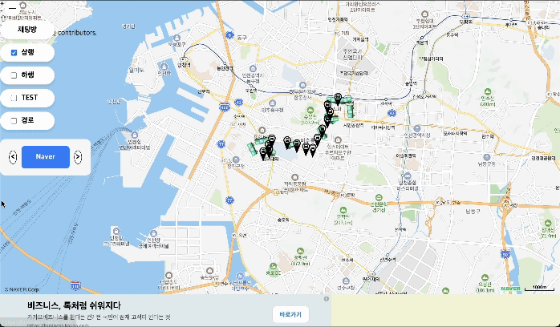
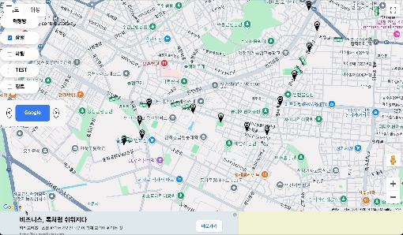

# react_map_pallet

## Description

example for the openSource
-> live bus project for 511 in incheon
http://www.mannomi.store





`react_map_pallet` is an intuitive, easy-to-use React component library for handling multiple map integrations within a single project. It supports popular mapping services like Google Maps, Naver Maps, Kakao Maps, and OpenLayers, allowing developers to seamlessly switch between them and add custom markers, event listeners, and sync map states such as center and zoom.

This library is ideal for developers who require flexible mapping capabilities in their React projects and want to handle cross-platform mapping services in a unified manner.

---

## Features

- **Multi-map Integration**: Supports Google Maps, Naver Maps, Kakao Maps, and OpenLayers.
- **Dynamic Marker Handling**: Add customizable markers to maps, including event callbacks (e.g., `onClick`).
- **State Sync**: Keeps map center and zoom synchronized across different map platforms.
- **OpenLayers for Free Open Source Mapping**: Fully customizable and does not require an API key.
- **Lightweight and Modular**: Only imports the specific map platform you need.

---

## Installation

You can install the package using npm:

````bash
npm install react_map_pallet

or with yarn:
yarn add react_map_pallet

Usage

Here’s a detailed guide to setting up and using react_map_pallet:

1. Import Required Components

```javascript
import { MapContainer, GoogleMapComponent, NaverMapComponent, KakaoMapComponent } from 'react_map_pallet';
import GoogleMarker from 'react_map_pallet/google/ui/marker';
import NaverMarker from 'react_map_pallet/naver/ui/marker';
import KakaoMarker from 'react_map_pallet/kakao/ui/marker';
import { useState } from 'react';
````

2. Setup Your Component

```javascript
const App = () => {
  const [mapType, setMapType] = useState("google"); // Switch between map types
  const [syncState, setSyncState] = useState({
    center: { lat: 37.5665, lng: 126.978 }, // Default center (Seoul)
    zoom: 12, // Default zoom level
  });

  const handleMarkerClick = (message) => {
    alert(message);
  };

  return (
    <div style={{ width: "100vw", height: "100vh" }}>
      <div style={{ position: "absolute", zIndex: 1000, top: 10, left: 10 }}>
        <button onClick={() => setMapType("google")}>Google Map</button>
        <button onClick={() => setMapType("naver")}>Naver Map</button>
        <button onClick={() => setMapType("kakao")}>Kakao Map</button>
        <button onClick={() => setMapType("openLayer")}>OpenLayer Map</button>
      </div>

      <MapContainer
        mapType={mapType}
        google="YOUR_GOOGLE_MAPS_API_KEY"
        naver="YOUR_NAVER_MAPS_API_KEY"
        kakao="YOUR_KAKAO_MAPS_API_KEY"
        openLayer={true}
        syncState={syncState}
        setSyncState={setSyncState}>
        {mapType === "google" && (
          <GoogleMarker
            position={{ lat: 37.5665, lng: 126.978 }}
            onClick={() => handleMarkerClick("Google Marker clicked!")}>
            <div
              style={{
                backgroundColor: "blue",
                width: "40px",
                height: "40px",
                borderRadius: "50%",
              }}
            />
          </GoogleMarker>
        )}
        {mapType === "naver" && (
          <NaverMarker
            position={{ lat: 37.5665, lng: 126.978 }}
            onClick={() => handleMarkerClick("Naver Marker clicked!")}>
            <div
              style={{
                backgroundColor: "green",
                width: "40px",
                height: "40px",
                borderRadius: "50%",
              }}
            />
          </NaverMarker>
        )}
        {mapType === "kakao" && (
          <KakaoMarker
            position={{ lat: 37.5665, lng: 126.978 }}
            onClick={() => handleMarkerClick("Kakao Marker clicked!")}>
            <div
              style={{
                backgroundColor: "yellow",
                width: "40px",
                height: "40px",
                borderRadius: "50%",
              }}
            />
          </KakaoMarker>
        )}
      </MapContainer>
    </div>
  );
};

export default App;
```

---

Supported Maps and API Keys

Google Maps

To use Google Maps, you need to generate an API key from Google Cloud Console.

Naver Maps

For Naver Maps, obtain an API key from the Naver Developers Portal.

Kakao Maps

For Kakao Maps, generate an API key from the Kakao Developers Portal.

OpenLayers

OpenLayers does not require an API key and can be used freely without additional setup. However, OpenLayers requires appropriate attribution for any map tiles used.

---

License

react_map_pallet is licensed under the BSD 2-Clause License.

OpenLayers Licensing Notes

## If you use OpenLayers, you must adhere to its BSD-style license. Additionally, map tile providers used with OpenLayers (such as OpenStreetMap) may have their own licensing requirements. Ensure that you include proper attribution when using such providers.

Contributing

We welcome contributions! Please follow these steps to contribute: 1. Fork the repository. 2. Create a new branch: git checkout -b feature/your-feature. 3. Commit your changes: git commit -m 'Add your feature'. 4. Push to the branch: git push origin feature/your-feature. 5. Submit a pull request.

---

Authors

    •	Manwook Han (hanmw110@naver.com)

---

Acknowledgments

## This library was created as part of a submission for the Open Source Development Competition. Special thanks to all contributors and testers for making this library possible.

Known Issues

    •	Some platform-specific map limitations may exist (e.g., marker customization).
    •	Ensure API keys are valid and added correctly in your application.

## For any issues or suggestions, please submit a GitHub issue.

```
This README file provides a comprehensive explanation of your package, including installation, usage, licensing, and contributing guidelines. Let me know if you'd like further adjustments!
```

1. @react-google-maps/api

   • Version: ^2.20.3
   • Description: A popular library for integrating Google Maps with React. It provides hooks and components for working with Google Maps API.
   • Installation:

```
npm install @react-google-maps/api1
```

    •	Docs: @react-google-maps/api Documentation

2.  react-naver-maps

    • Version: ^0.1.3
    • Description: A React wrapper for Naver Maps, enabling the integration of Naver Maps into React applications.
    • Installation:

    ```
    npm install react-naver-maps
    ```

    • Docs: react-naver-maps GitHub

3.  react-kakao-maps-sdk

    • Version: ^1.1.27
    • Description: A React wrapper for Kakao Maps, providing an easy way to integrate Kakao Maps into React applications.
    • Installation:

    ```
    npm install react-kakao-maps-sdk
    ```

    • Docs: react-kakao-maps-sdk GitHub

4.  ol (OpenLayers)

        •	Version: ^10.3.1
        •	Description: A high-performance, feature-rich mapping library for embedding maps and geographic data in web applications. OpenLayers is used for OpenStreetMap-based maps and other customizable layers.
        •	Installation:

    `npm install ol`
    • Docs: OpenLayers Documentation

5.  recoil

    • Version: ^0.7.7
    • Description: A state management library for React that allows you to manage application state with a more flexible and scalable approach.
    • Installation:
    `npm install recoil`
    • Docs: Recoil Documentation

6.  styled-components

    • Version: ^6.1.13
    • Description: A library for writing CSS in JavaScript. It allows you to style your React components using tagged template literals.
    • Installation:
    `npm install styled-components`
    • Docs: styled-components Documentation

7.  react-scripts

    • Version: ^5.0.1
    • Description: A set of scripts that help with React development, bundling, and testing using Webpack, Babel, ESLint, and other tools.
    • Installation:`npm install react-scripts`
    • Docs: react-scripts Documentation

8.  cra-template

    • Version: 1.2.0
    • Description: A custom template for creating a new React application.
    • Installation:`npm install cra-template`
